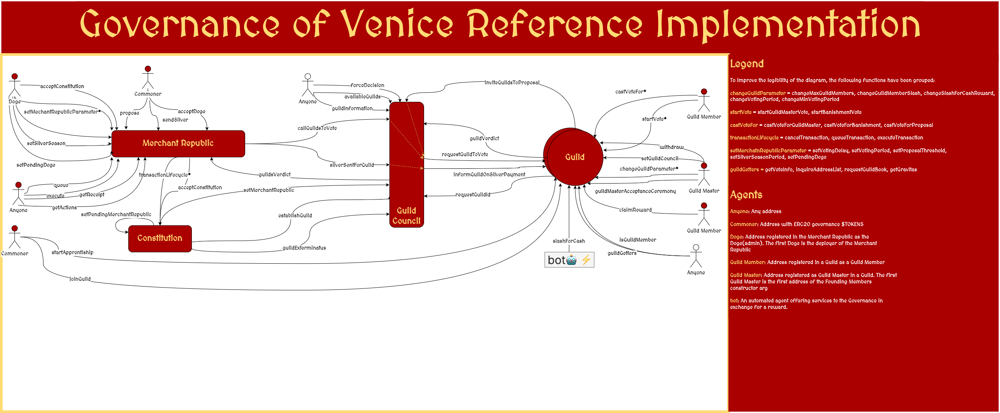

# Gov of Venice


Governance of Venice is a new paradigm in DAO governance, attempting to standardise existence of functional groups within DAOs, known as Guilds.

This repository offers a reference implementation as also describes a general architecture for the standardisation of the interfaces and communication between the existing Governance modules and the Guild contracts.

## Architecture

The main components of the design are:
- Merchant Republic & Constitution
- Guild Council
- Guild(s)

A Governance entity (e.g a DAO) is composed of:
- 1 Constitution
- 1 Merchant Republic
- 1 Guild Council
- N Guilds

A single Guild can participate in many different Merchant Republic's (N:M relationship).

## Inter-DAO standard

With our work, we want to suggest a simple standard for inter-DAO participation of guilds that function, for all intents and purposes, as little DAOs. As far as the standard is concerned, a Guild is an addres that supports a simple and specific set of interfaces, mainly around sending proposals and receiving verdicts.

The standard is intentionally vague about the type of the Governance protocol and the Guild. It focuses on their intercommunication and how they work as autonomous units. That means that a Guild may elect to function in any way it seem best, from a closely-knit group of people who align over a video call and the Guild is controlled from a single EOA account, to a trustless Guild where Guild Members **vote** on how the Guild should respond.

Thus, we define the following function signatures:


## Refeference Implementation

Click on the image for high-resolution `.svg` diagram.

[](assets/gov-of-venice.svg)


In short, the constitution and the merchant republic are near-identical forks of the Governance Bravo smart contracts, with the constitution playing the role of the `timelock`.

At it's core, the Merchant Republic governance process is identical to the Governor Bravo, albeit an extra state: `pendingGuildsVote`. Every proposal must first be approved by *some* guilds in order to be voted by token holders. The guilds which are responsible for allowing it to pass (or not) are defined in the very proposal.

The Guild Council functions a simple registry and proxy, meaning that it registers that Guild that participate in the Governance and proxies specific requests from the Merchant Republic to the Guilds.

The Guild reference implementation is truly a small subset of the different designs. It can be absolutely trustless or centralised without losing it's  value as a checking mechanism for the DAO. In the reference implementation, we opted to take a more decentralized approach, where every token holder (commoner in the lingo) can enter the Guild, if they have accumulated enough gravitas.


## Deployment

Gov of Venice uses Daptools for testing and deployment. We have created a few helpful scripts to easily deploy both the Governance Modules and Guilds.

To deploy on mainnet:
```
make deploy-mainnet
```
and for Rinkeby:
```
make deploy-rinkeby
```
### Deployment test

If you want to deploy a deployment for testing purposes, do `export TEST=true` before running the deployment makefile command.

The testing deployment includes some hardcoded seth commands that will be used to configure Gov of Venice, so that it's ready to be used for testing purposes.

The testing deployment also includes a mockERC20 that can be used to mint ERC20 tokens for voting purposes.

### Configure Deployment

After the Governance modules have been deployed using the deployment scripts, they will need to be configured so that Gov of Venice can start functioning.

**1. Sign The Constitution**: Configure the Constitution contract (aka Timelock) to the Merchant Republic instance that was just deployed.

```
seth send $CONSTITUTION "signTheConstitution(address, uint256)()" $MERCHANT_REPUBLIC $DELAY
```
where:
- `$CONSTITUTION`: Constitution smart contract address.
- `$MERCHANT_REPUBLIC`: Merchant Republic smart contract address.
- `$DELAY`: The delay, in seconds, required between queuing a transaction and executing it.

**2. Initialize Merchant Republic**: Initialize the Merchant Republic. At the initialization stage, we configure the most important parameters of the governance module as also define the first Doge (Admin), which is the caller of the initialization function.

```
seth send $MERCHANT_REPUBLIC 'initialize(address, address, address, uint48, uint256, uint256, uint256)()' $CONSTITUTION $DUCATS $GUILD_COUNCIL $MAX_GUILD_TIME $VOTING_PERIOD $VOTING_DELAY $PROPOSAL_THRESHOLD
```
where:
- `$CONSTITUTION`: The address of the constitution.
- `$DUCATS`: The address of the ERC20 smart contract that also supports voting.
- `$GUILD_COUNCIL`: The address of the Guild Council.
- `$MAX_GUILD_TIME`: The maximum voting period that the Merchant Republic allows for Guilds that want to join it.
- `$VOTING_PERIOD`: The total duration of voting, from proposal submission, to guild and finally commoners voting.
- `$VOTING_DELAY`: The delay between the response of the guilds and the start of the commoner's vote.
- `$PROPOSAL_THRESHOLD`: The number of available votes a commoner is required to have in order to submit a proposal to the Merchant Republic.

All the time-related fields are in seconds.

**3. Initiate Merchant Republic**: Sets the proposal counter to the correct number, based on whether it inherits the numbering from a previous deployment of a Merchant Republic.

```
seth send $MERCHANT_REPUBLIC '_initiate(address)()' $PREVIOUS_MERCHANT_REPUBLIC
```

where:
- `$PREVIOUS_MERCHANT_REPUBLIC`: The address of the previous instance. If it's the first time, simply ass `0`.

At this point, the Governance of Venice is deployed and ready to be used.

**Disclaimer**
Mind that the Merchant Republic has a limit for up to 5 proposals to be submitted without passing through the Guild voting process. That means that one of the first proposals of the Merchant Republic needs to be the approval of a Guild.

Guilds are vital for Governance Process and this forcing mechanism ensures that the Merchant Republic does not regret to a simple Governance Bravo fork that only includes token holders voting.

### Deploy a Guild

Now that the Governance of Venice is deployed and configured, we need to create a Guild.

The Guild can be any smart contracts that adheres to the [Guild Interface](src/IGuild.sol), but we offer a reference implementation and a deployment script for it.

The interactive deployment script will walk you through the constructor args that are needed for the Guild, as also explain their meaning.

To deploy a Guild interactively, run:

```
# Deploy on mainnet
make deploy-mainnet Guild

# Deploy on Rinkeby
make deploy-rinkeby Guild
```

### Register a Guild to the Gov of Venice

For a Guild to start engaging in the governance process of the Gov of Venice, it needs to be registered in the Merchant Republic via the Guild Council.

1. The Guild or the Merchant Republic's commoners start a thread in some discussion forum in order to align the commoners around the Guild joining the Governance process.
2. Then a commoner must make a formal proposal to the Governance module that will invoke a specific function of the Guild Council that will register the Guild. The function can only be invoked by the Constitution smart contract (the executor of proposals passed by the Merchant Republic).
3. Then, if it passes, the Guild Master of the Guild invokes a function on the Guild smart contract that registers the Guild Council to the Guild and ratifies the cooperation between the Merchant Republic and the Guild.

The function signature for the proposal:
```
establishGuild(address, uint48)(uint48)' $GUILD_ADDRESS $MIN_DECISION_TIME
```
where:
- `$GUILD_ADDRESS`: The address of the Guild.
- `$MIN_DECISION_TIME`: The minimum decision time that the Guild sets as requirement for it to join the governance process. It signals the flexibility of the Guild in terms of reaction time.
- The function returns the `$GUILD_ID` of the Guild for that particular Guild Council. It's unique for the Guild Council, but the GUILD can have the same ID on many different Guild Council. The ID is also emitted as an event `GuildEstablished`.

The command for the Guild Master to ratify the registration:

```
seth send $GUILD 'setGuildCouncil(address, uint256, uint48)()' $GUILD_COUNCIL $SILVER_RATIO $GUILD_ID
```
where:
- `$GUILD_COUNCIL`: The address of the Guild Council
- `$SILVER_RATIO`: The ratio between gravitas and silver (silver = 1$TOKEN of the Merchant Republic's native ERC20 token)
- `$GUILD_ID`: The id of the Guild for that particular Guild Council.

Now the Guild is deployed and configured to participate in the governance process of the Merchant Republic. Remember, that a Guild can join **any** number of Merchant Republics.
